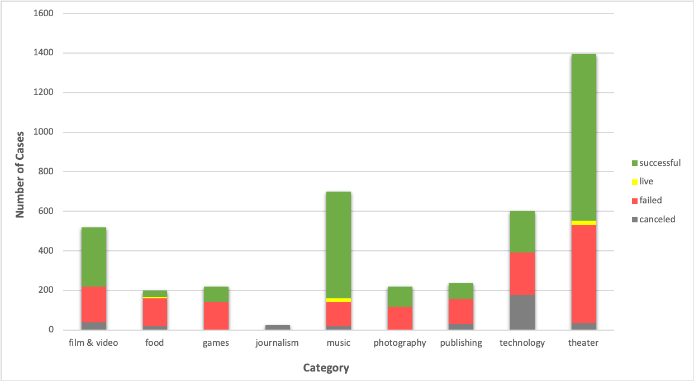
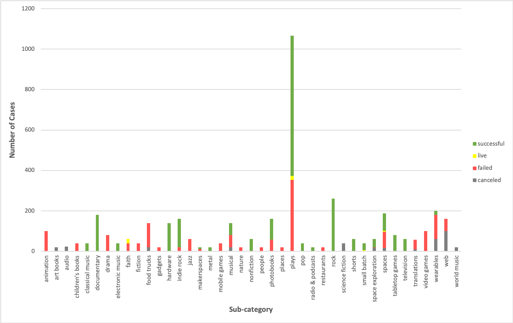

# Kickstart Analysis 

## Background

Over $2 billion has been raised using the massively successful crowdfunding service, Kickstarter, but not every project has found success. Of the more than 300,000 projects launched on Kickstarter, only a third have made it through the funding process with a positive outcome.
Getting funded on Kickstarter requires meeting or exceeding the project's initial goal, so many organizations spend months looking through past projects in an attempt to discover some trick for finding success. For this week's homework, you will organize and analyze a database of 4,000 past projects in order to uncover any hidden trends.

## Analysis Report

### Conclusions we can draw about Kickstarter campaigns

1. Out of the 9 categories, “Theater” has the largest number of total projects (n = 1393). It also has the largest number of successful projects (n = 839). The category that has the highest successful rate is “Music” (77.14%), followed by “Theater” (60.23%) and “Film & Video” (57.69%). Thereby, current data suggests that projects in these categories are more likely to be successful comparing with other categories. However, “Theater” category also has the largest number of failed projects (n = 493). It also should be noted that “Technology” has the largest number and rate of canceled project (178 out of 600). It is hard to find out a reason without more details about the projects, so hope there will be additional information provided for a more in-depth analysis. 

2. For the sub-categories, there are several of them have 100% successful rate (Rock, Documentary, Hardware, Tabletop games, Television, etc.) Although we cannot say these sub-categories are guaranteed to be successful without further information, they are still more likely to be succeed comparing with other sub-categories. “Plays” under the parent category “Theater” has the largest number of both total number of projects (n = 1066), as well as number of successful projects (n = 694). It is obvious that the current market has an interest on projects fall under this category.

3. When we look at the date each project were launched, the projects that were launched in May are more likely ended up being successful (n = 234) comparing with those were launched in December (n = 111). With that being said, date that a project was launched could be a factor that impact whether or not it get a positive outcome.  

### Limitations of this dataset

### What are some other possible tables and/or graphs that we could create?

### * Backers count Statistical Analysis
#### * Use your data to determine whether the mean or the median summarizes the data more meaningfully.

#### * Use your data to determine if there is more variability with successful or unsuccessful campaigns. Does this make sense? Why or why not?

